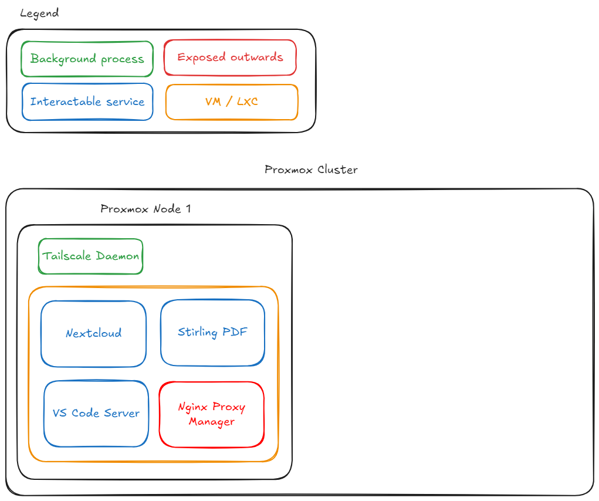

# My Home Server

## Overview
This repository serves as a backup for the configuration files of my various hosted services. I've done this to ensure they can be easily restored or migrated if needed. Additionally, this repository documents my current hardware setup / installed software and helps me brush up on my DevOps skills.

If anyone is interested in hosting their own services, feel free to refer to my work!

## Hardware

### Intel NUC NUC7i5BEK

This is the only dedicated hardware I own at the moment. This is my first node. Here are the specifiations for those interested:
- CPU: Intel Kaby lake i5-7260U 2 cores 4 threads @2.20GHz - Turbo 3.40 GHz
- GPU: Intel Iris Plus Graphics 640 300 MHz - 1.05 GHz
- RAM: 2 DDR4 SO-DIMM Slots up to 32 GB
- Storage:
	- M.2 slot "22x42/80" (Came with a 512 GB SSD with Windows 10)
	- Micro SD card slot
- I/O: 
	- USB 3.0 2x front 2x rear (2x internal configurable USB 2.0)
	- Intel Dual Band Wireless-AC 8265
	- Bluetooth 4.2
	- 3.5mm Audio/Mic
	- HDMI 2.0a
	- Thunderbolt 3 port on rear

> In the long run, I'm planning on making a mini-server rack like [this](https://mini-rack.jeffgeerling.com/) and also create a Kubernetes (K8s) cluster of nodes that work together to run containerized applications in an automated, scalable way

## Software

- [Proxmox Virtual Environment](https://www.proxmox.com/en/proxmox-virtual-environment/overview)
    
    "Proxmox Virtual Environment is a complete, open-source server management platform for enterprise virtualization. It tightly integrates the KVM hypervisor and Linux Containers (LXC), software-defined storage and networking functionality, on a single platform. With the integrated web-based user interface you can manage VMs and containers, high availability for clusters, or the integrated disaster recovery tools with ease."

    This is my choice of hypervisor. I'm planning on expanding my home server to a cluster of efficient devices and I really need Proxmox's cluster feature down the line for enabling **High Availability** on my services.

- [Ubuntu Server](https://ubuntu.com/server)

    There is currently only one VM of Ubuntu Server running on the Proxmox Virtual Environment. I plan to make separate VMs for different categories of services down the line, this is temporary.

## Current status



## Setup

1. Navigate to the directory of interested service (present in [services](services/)) and update configurations as necessary.
2. Deploy using Docker Compose:
```bash
docker-compose up -d
```

In progess: Making a master `docker-compose.yaml` file to launch all services with one command. 

## Services

### AdGuard Home 
AdGuard Home is a network-wide ad blocker and privacy tool that filters ads, trackers, and malicious domains at the DNS level. It enhances browsing security and speeds up page loading by blocking unwanted content before it reaches devices.


Xfinity Gateway routers do not let me change the DNS and DHCP settings of the router. (Thanks Xfinity :| )


### Code server
VS Code Server is a backend service that enables running Visual Studio Code on a remote machine while accessing it through a local browser or VS Code client.


### Nextcloud AIO
Nextcloud is an all-in-one deployment of Nextcloud, a self-hosted cloud storage and collaboration platform. This version simplifies installation and maintenance by bundling Nextcloud with optimized components like a database and backup tools in Docker containers.


### Nginx Proxy Manager
Nginx Prioxy Manager is a web-based, user-friendly tool for managing Nginx as a reverse proxy, making it easy to route domains to different services, enable SSL, and apply access restrictions without editing configuration files manually.


### Stirling PDF
Stirling PDF is a powerful document processing tool designed for Optical Character Recognition (OCR) and PDF manipulation. It is everything Adobe Acrobat Reader is and some more.


### Tailscale
Tailscale is a simple, secure mesh VPN based on WireGuard, allowing seamless private network connectivity across multiple devices without complex firewall or NAT configurations. It enables zero-trust networking and remote access.


### Traefik
Traefik is a modern, cloud-native reverse proxy and load balancer that automatically discovers and routes traffic to services using dynamic configuration. It supports Docker, Kubernetes, and Let’s Encrypt for seamless SSL management.


Setup is complete, however migrated to Nginx Proxy Manager for ease of use.


## Notes

These configurations are specific to my setup and may need modifications for different environments.

Ensure that any sensitive information (API keys, passwords) are updated before composing the `docker-compose.yaml` files.
